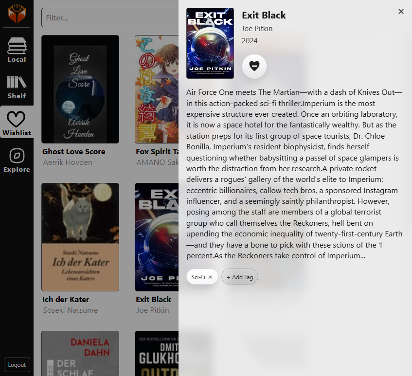

<picture>
  <source media="(prefers-color-scheme: dark)" srcset="public/icons/logo_full_dark.png">
  <source media="(prefers-color-scheme: light)" srcset="public/icons/logo_full.png">
  
</picture>

Your self-hosted, Calibre-powered reading sanctuary. Read your ebooks anywhere, on any device, fully offline.

Foxtales decouples your ebook library from a single machine, giving you and your family a private, reader-friendly web app that syncs your progress across all your devices: Desktops, Smartphones, Tablets and Ebook Readers.

The development is focused on these features:

* Offline support: Read your most loved books in the deepest desert.
* Ebook-Reader friendly
* Mobile friendly
* Easy to self-host
* Installable Web-App
* Sync of reading progress across devices
* Avoid vendor lock-in by managing the whole library in Calibre-compatible format

## UI

## Installation

Just copy the [docker-compose.yaml](docker-compose.yaml) to your machine or server, modify the variables so that it
suits your needs and run it using `docker compose up`

⚠️ I do not have to tell you that the password "password" is a bad idea, so please change it ;-)

## Supported file formats

* EPUB
* CBZ
* PDF
* MOBI
* KF8 (AZW3)
* FB2

## Roadmap and planned features

| Feature                                | Status   |
|----------------------------------------|----------|
| Provide Docker container               | Done     |
| Implement pagination for big libraries | Done     |
| Sync reading progress                  | Done     |
| Implement search features              | Done     |
| Multi-User                             | Done     |
| Browse books by tags                   | Done     |
| Wishlist books                         | Done     |
| Add book discovery                     | Done     |
| Online Demo                            | Planned  |
| Annotations                            | For Epub |

## Technical stuff

The frontend is written in VueJS, using foliate-js to display the ebooks.

The backend is written in Python, using FastAPI and calibredb to communicate with the shipped Calibre instance.

## Contributions
* Based on https://github.com/jinhuan138/vue-book-reader
* Using https://github.com/johnfactotum/foliate-js
* Backend heavily depends on https://calibre-ebook.com
* Icons from www.svgrepo.com
